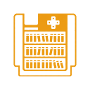
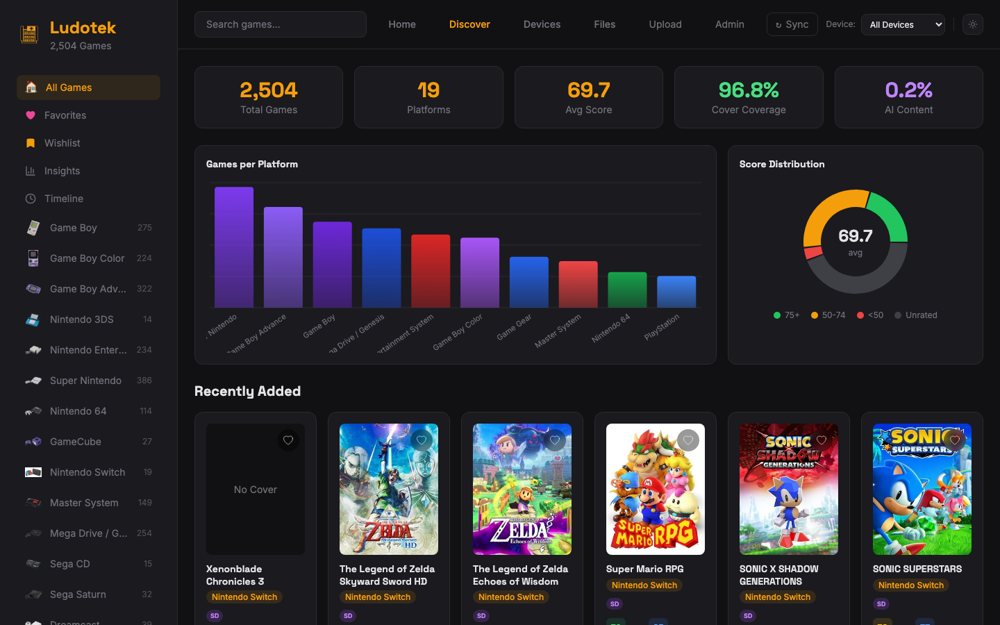

<div align="center">
  
  <h1>Ludotek</h1>
  <p><strong>Your personal retro game library — scan, enrich, browse.</strong></p>
  <p>
    Ludotek scans your devices for ROMs, enriches them with metadata from IGDB,
    and gives you a beautiful library to explore your collection.
  </p>

  <p>
    
    
    
    
    
    
  </p>
</div>

---



## Features

- **Device Scanning** — Connect via SSH, FTP, or local filesystem. Auto-detect ROMs across 50+ platforms.
- **IGDB Enrichment** — Covers, ratings, release dates, genres, developer info, and summaries.
- **AI-Powered Discover** — Smart game recommendations and AI-generated stories via OpenRouter.
- **Timeline** — Browse your collection by gaming era, from 8-bit classics to modern retro.
- **Insights** — Genre distribution, top franchises, era charts, and collection analytics.
- **Setup Wizard** — Guided first-run setup. Add a device, configure scan paths, enter API keys.
- **File Manager** — Browse, rename, and delete ROMs on connected devices.
- **ROM Upload** — Upload ROMs from your browser with automatic format detection.
- **Docker Ready** — One-command deployment with persistent volumes.

## Quick Start

### Docker (recommended)

```bash
curl -O https://raw.githubusercontent.com/Codevena/ludotek/main/docker-compose.yml
docker compose up -d
```

Open [http://localhost:3000](http://localhost:3000) — the setup wizard will guide you through configuration.

### Manual

```bash
git clone https://github.com/Codevena/ludotek.git
cd ludotek
pnpm install
cp .env.example .env
pnpm prisma migrate deploy
pnpm dev
```

Open [http://localhost:3000](http://localhost:3000).

## Configuration

| Variable | Default | Description |
|----------|---------|-------------|
| `DATABASE_URL` | `file:./dev.db` | SQLite database path |
| `ADMIN_TOKEN` | _(empty)_ | Optional auth token. Empty = no authentication. |
| `OPENROUTER_MODEL` | `google/gemini-3.1-flash-lite-preview` | AI model for Discover & Stories |

All other settings (IGDB API keys, devices, scan paths) are configured through the UI after first launch.

## Contributing

See [CONTRIBUTING.md](CONTRIBUTING.md) for setup instructions and guidelines.

See [docs/architecture.md](docs/architecture.md) for a system overview.

## License

[MIT](LICENSE)
