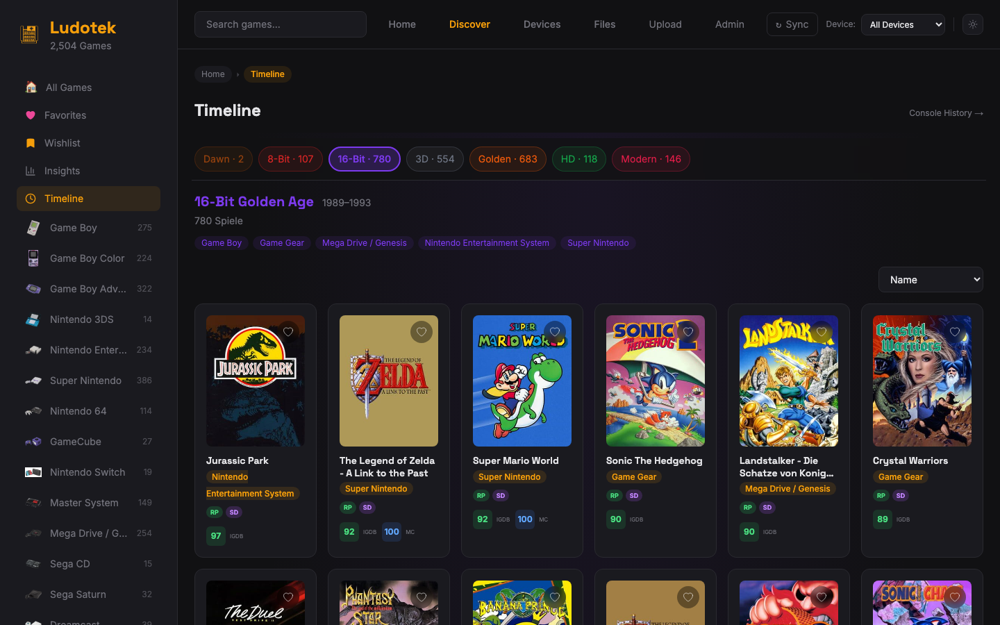
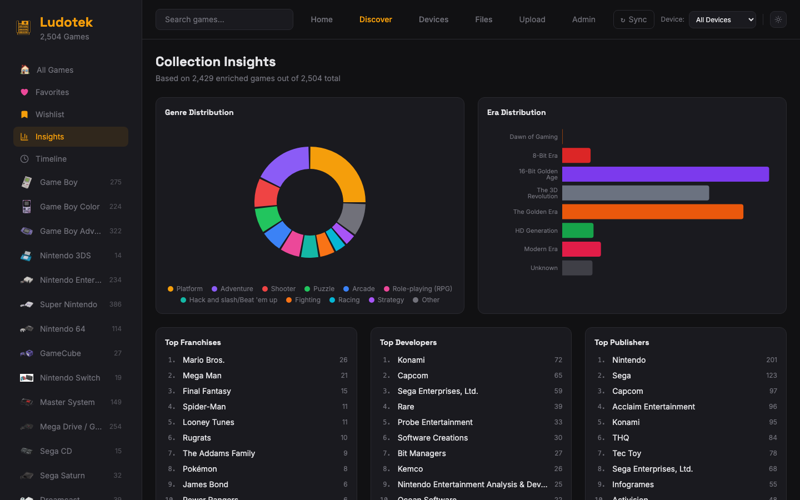
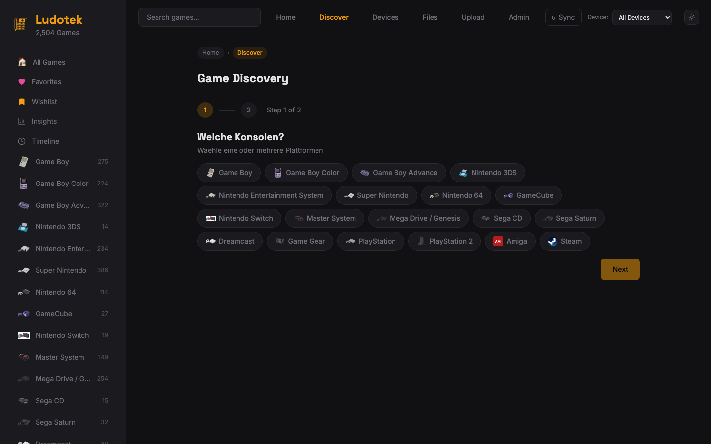
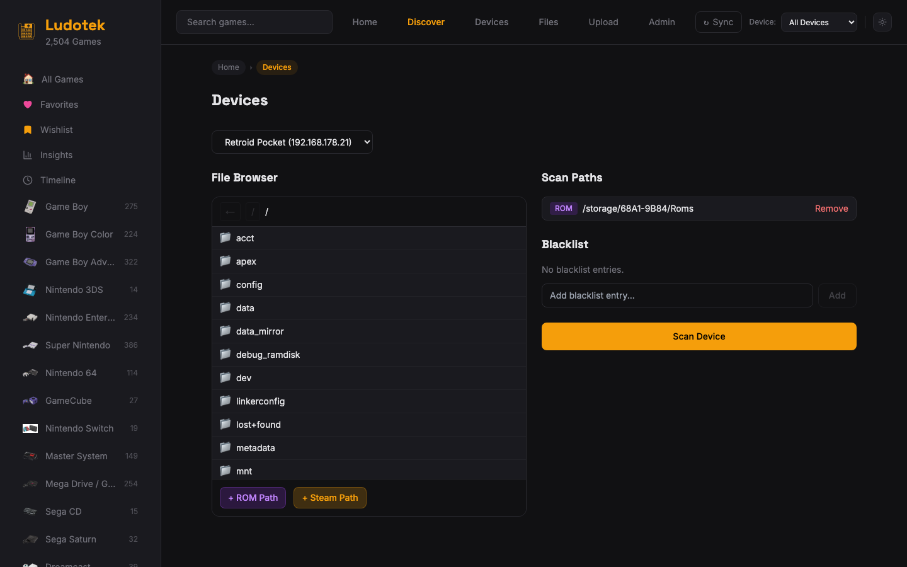

<div align="center">
  
  <h1>Ludotek</h1>
  <p><strong>Your personal retro game library — scan, enrich, browse.</strong></p>
  <p>
    Ludotek scans your devices for ROMs, enriches them with metadata from IGDB,
    and gives you a beautiful library to explore your collection.
  </p>

  <p>
    
    
    
    
    
    
  </p>
</div>

---


<details>
<summary><strong>More Screenshots</strong></summary>

#### Timeline


#### Insights


#### Discover


#### Devices


</details>

## Features

### Device Scanning

Connect to your Steam Deck, Retroid Pocket, or any device via **SSH, FTP, or local filesystem**. Ludotek auto-detects ROMs across **66 platforms** — from Atari 2600 to Nintendo Switch. It recursively scans directories, handles subdirectory layouts (like ES-DE's `xbox/roms/`), cleans filenames, and deduplicates multi-disc games automatically.

### IGDB Enrichment

One click fetches **covers, ratings, release dates, genres, developers, publishers, summaries, screenshots, artwork, and YouTube trailers** from IGDB for your entire collection. Sequential processing respects rate limits with automatic retry on failures. Missing covers fall back to SteamGridDB. All images are cached locally.

### AI-Powered Fun Facts & Stories

Ludotek generates **Fun Facts** (trivia bullet points) and **Story & Background** (narrative about development and legacy) for each game using AI via OpenRouter. Content is rendered as styled markdown on the game detail page, with a refresh button to regenerate individual games. Supports English and German.

### Discover & Recommendations

An AI-powered recommendation engine. Pick your platforms and interests, and Ludotek analyzes your library to suggest games you already own that match, plus missing gems to add to your wishlist. Each recommendation includes a reason why it was picked, expandable details with artwork and trailers, and one-click "Add to Wishlist".

### Timeline

Browse your collection by **gaming era** — from the Dawn of Gaming through 8-Bit, 16-Bit Golden Age, 3D Revolution, and into the Modern Era. Each era shows game counts, platform breakdowns, and a color-coded grid. Includes a Console History page with historical write-ups for every platform in your collection.

### Insights & Analytics

Visual dashboard with **genre distribution** (donut chart), **era distribution** (bar chart), **top franchises, developers, and publishers** (ranked lists), and cross-platform game detection. All charts adapt to your light/dark theme.

### File Manager

Dual-pane file browser for managing ROMs across devices. Browse, transfer (copy or move), rename, and delete files between any two connected devices. Real-time transfer progress with filename, file count, and percentage. Create folders, preview files, and navigate with breadcrumbs.

### ROM Upload

Upload ROMs directly from your browser. **Smart mode** auto-detects platforms from folder structure; **manual mode** lets you pick. A 4-stage pipeline handles format conversion, transfer to device, scanning, and IGDB enrichment — all with real-time per-file progress streaming.

### Sync Queue

Stage rename and delete operations on remote devices, review them in the Sync Panel, then apply all changes atomically. Operations are grouped by device with status tracking and error reporting.

### Wishlist

Track games you want to find. Add from Discover recommendations or manually, with configurable ROM search links to find them online. Persistent across sessions.

### Search & Favorites

Global search with live suggestions (debounced, 200ms). Favorite any game with a heart toggle — filter your library to favorites only.

### Setup Wizard

Guided first-run setup in 5 steps: add a device, configure scan paths via file browser, enter API keys, and trigger your first scan. No config files to edit.

### Dark & Light Theme

System-aware theme with manual toggle (sun/moon icon in the header). Warm Stone light palette, classic dark palette. Persisted in localStorage, no flash on page load.

### Security

Device passwords and API keys are encrypted at rest with **AES-256-GCM**. Keys auto-generated on first run, configurable via `ENCRYPTION_KEY` env var. Optional admin token authentication.

### Docker Ready

One-command deployment with persistent volumes for database and image cache.

## Quick Start

### Docker (recommended)

```bash
curl -O https://raw.githubusercontent.com/Codevena/ludotek/main/docker-compose.yml
docker compose up -d
```

Open [http://localhost:3000](http://localhost:3000) — the setup wizard will guide you through configuration.

### Manual

```bash
git clone https://github.com/Codevena/ludotek.git
cd ludotek
pnpm install
cp .env.example .env
npx prisma db push
pnpm dev
```

Open [http://localhost:3000](http://localhost:3000).

## Configuration

| Variable | Default | Description |
|----------|---------|-------------|
| `DATABASE_URL` | `file:./dev.db` | SQLite database path |
| `ADMIN_TOKEN` | _(empty)_ | Optional auth token. Empty = no authentication. |
| `ENCRYPTION_KEY` | _(auto-generated)_ | AES-256 key for encrypting secrets. Auto-generated to `data/.encryption-key` if not set. |
| `OPENROUTER_MODEL` | `google/gemini-2.5-flash` | AI model for Discover, Fun Facts & Stories |

All other settings (IGDB API keys, SteamGridDB key, devices, scan paths) are configured through the UI after first launch.

## Supported Platforms

66 systems including: Game Boy, GBA, DS, 3DS, NES, SNES, N64, GameCube, Wii, Wii U, Switch, Master System, Mega Drive, Saturn, Dreamcast, Game Gear, PlayStation 1-3, PSP, PS Vita, Xbox, Xbox 360, Atari (2600/5200/7800/Lynx/Jaguar/ST), TurboGrafx-16, Neo Geo, WonderSwan, 3DO, ColecoVision, DOS, Commodore 64, Amiga, MSX, ZX Spectrum, Arcade, PICO-8, ScummVM, and more.

## Contributing

See [CONTRIBUTING.md](CONTRIBUTING.md) for setup instructions and guidelines.

See [docs/architecture.md](docs/architecture.md) for a system overview.

## License

[MIT](LICENSE)
